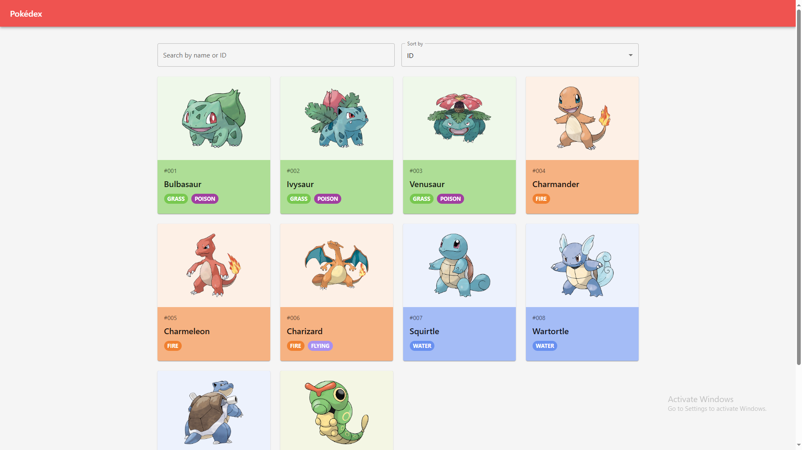

# React Pokédex

A modern, responsive Pokédex application built with React and Material-UI, powered by the PokeAPI.

Access the project here:https://vercel.com/ceds-projects-ad8759a4/pokedex


## Features

- **Pokemon List View**
  - Responsive grid layout of Pokemon cards
  - Infinite scroll with "Load More" functionality
  - Search Pokemon by name or ID
  - Sort Pokemon by ID or name
  - Dynamic type badges with color coding

- **Detailed Pokemon View**
  - High-quality official artwork
  - Complete Pokemon statistics
  - Type weaknesses (calculated from PokeAPI data)
  - Evolution chain visualization
  - Species information and description
  - Navigation between Pokemon

## Tech Stack

- **React** - Frontend framework
- **Material-UI** - UI component library
- **Axios** - HTTP client for API requests
- **PokeAPI** - Pokemon data source

## Installation

1. Clone the repository:
   ```bash
   git clone <your-repo-url>
   cd pokedex
   ```

2. Install dependencies:
   ```bash
   npm install
   ```

3. Start the development server:
   ```bash
   npm start
   ```

The application will open in your default browser at `http://localhost:3000`.

## Project Structure

```
src/
├── components/           # React components
│   ├── PokemonList.jsx  # Main list view
│   ├── PokemonCard.jsx  # Individual Pokemon card
│   └── PokemonDetail.jsx # Detailed Pokemon view
├── services/            # API and data services
│   └── pokemonService.js # PokeAPI integration
└── utils/              # Utility functions
```

## API Integration

This project uses the [PokeAPI](https://pokeapi.co/) for all Pokemon data. The application fetches:
- Basic Pokemon information (name, ID, types)
- Detailed statistics and abilities
- Evolution chains
- Type effectiveness and weaknesses
- Species information and descriptions

## Contributing

1. Fork the repository
2. Create your feature branch (`git checkout -b feature/AmazingFeature`)
3. Commit your changes (`git commit -m 'Add some AmazingFeature'`)
4. Push to the branch (`git push origin feature/AmazingFeature`)
5. Open a Pull Request

## License

This project is licensed under the MIT License - see the LICENSE file for details.

## Acknowledgments

- [PokeAPI](https://pokeapi.co/) for providing the Pokemon data
- [Material-UI](https://mui.com/) for the UI components
- Pokemon is 1995-2024 Nintendo/Creatures Inc./GAME FREAK inc.
